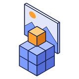

<p align="center">
  
</p>

<h1 align="center">Reference Planes</h1>

<p align="center">
  Reference images for BlockDesigner: put pictures in the scene, like Blender's reference images,<br>
  and build from them.
</p>

<p align="center">
  <a href="https://github.com/doolecg/BlockDesigner-ReferencePlanes/releases/latest"></a>
  <a href="https://github.com/doolecg/BlockDesigner-ReferencePlanes/releases"></a>
  <a href="LICENSE"></a>
  
  <a href="https://github.com/doolecg/BlockDesigner"></a>
</p>

---

Reference Planes is a plugin for [BlockDesigner](https://github.com/doolecg/BlockDesigner), the Windows editor for Minecraft builds. It is released
on its own, separately from the app. It needs **BlockDesigner 0.4.14 or later** (plugin API 4).

**Contents:** [Download](#download-and-install) · [Features](#features) · [Building from source](#building-from-source) · [Project layout](#project-layout)

## Download and install

Get the latest version from the [releases page](https://github.com/doolecg/BlockDesigner-ReferencePlanes/releases/latest):

1. Download `reference-planes-<version>.jar`.
2. In BlockDesigner open **Plugins (puzzle icon) › Manage plugins… › Install…** and pick the jar.

It is on straight away. You can switch it off, reload or uninstall it in the same window. From 1.1.2 on it **updates itself** in BlockDesigner 0.4.16 and later (Plugins › Manage plugins… › Update plugins automatically). Plugins run with the same
access as BlockDesigner itself, so only install ones you trust.

## Features

### Adding pictures

- **Its tab on the right** shows it's running, what it adds, and settings for new pictures: their height, opacity,
  whether blocks cover them, and whether one added in an axis view shows only there.
- **Add a picture:** **Plugins › Add reference image…**, or drop a PNG, JPEG, GIF or BMP file on the window (or pick
  it in **Import**). If another plugin also takes pictures (the Palette Tools example turns them into pixel art),
  BlockDesigner asks which one you want.
- **Where it goes:** at the point the camera orbits around, 16 blocks tall, facing you. Added in an orthographic axis
  view (numpad 1 / 3 / 7, or a view cube face), it faces that view straight on and **shows only in that view**, like
  Blender's "align to view" references. Otherwise it shows in every view.

### Editing them

- **Layers panel:** reference images are listed above the layers with a **REFERENCE** tag. Click one to select it,
  double-click to rename it, and use the eye and lock buttons to hide or lock it.
- **Move / rotate / scale:** select it (a click in the view or in the Layers panel), then use **G** (Move),
  **R** (Rotate) or **S** (Scale) and drag the gizmo. Hold **Ctrl** to snap to whole blocks, 15° and 0.1× steps. **Esc** or a
  right-click cancels the drag, and **Delete** removes the selected picture. Every change can be undone.

### Right-click menu

- **Right-click** a picture in the view, or its row in the Layers panel, for its menu:

| Entry | What it does |
|---|---|
| Properties… | Every number in one window: position, rotation, scale, UV offset and scale, opacity |
| Position, rotation, scale | Fields for X, Y and Z (press Enter to apply), **Reset rotation**, **Reset aspect ratio** (back to the picture's own proportions) |
| UV offset and scale | Shift or zoom the picture on its plane. Outside the picture the plane is see-through. **Reset UV** |
| Opacity | A slider and 100 / 75 / 50 / 25 % |
| Show in | All views, orthographic views only, or one orthographic view (Front, Back, Left, Right, Top, Bottom) |
| Draw | **Behind blocks** (a backdrop that blocks always cover), **In the scene** (blocks in front hide it), **In front of blocks** |
| Flip horizontally / vertically | Mirror the picture |
| Align to the … view / Face the camera | Turn the plane to face the current view |
| Show only in the … view | Limit it to the current axis view |
| Replace picture… | Swap the picture and keep the plane where it is |
| Rename, Focus camera, Hide, Lock, Delete | Added by BlockDesigner for every scene object |

### Saved with the project

Pictures are saved inside the `.bdproj` project, so a project still opens with its references on another PC. Very
large pictures are shown at up to 4096 pixels a side, but they are saved at full size.

## Building from source

You need Windows and a JDK 26 (Temurin 26 is what BlockDesigner uses; set `org.gradle.java.home` in
`gradle.properties` to yours). Then:

```
./gradlew jar      # build/libs/reference-planes-<version>.jar
```

The plugin compiles against the BlockDesigner plugin API jars in [`libs/`](libs) (from BlockDesigner 0.4.23). The app
provides them, and JavaFX, at runtime, so they are never bundled into the plugin. To target a newer API, replace them
with the jars from a newer BlockDesigner build (`./gradlew :plugin-api:jar :core:jar` in the
[BlockDesigner repository](https://github.com/doolecg/BlockDesigner)) and update the file names in `build.gradle.kts`.

The version is set in `build.gradle.kts` and copied into the jar's `blockdesigner-plugin.json`. To release a new
version, change it there, add a section to [RELEASE_NOTES.md](RELEASE_NOTES.md), build the jar and attach it to a
GitHub release tagged with the version.

For writing plugins, see BlockDesigner's [plugin guide](https://github.com/doolecg/BlockDesigner/blob/main/PLUGINS.md) and
[API reference](https://github.com/doolecg/BlockDesigner/blob/main/docs/plugin-api-reference.md).

### Tests

```
./gradlew test
```

The tests cover the plugin's logic that runs without the app, against the API jars in `libs/`.

## Project layout

| Path | What it does |
|---|---|
| `src/main/java` | The plugin's code |
| `src/main/resources/blockdesigner-plugin.json` | The manifest BlockDesigner reads: id, name, version, main class, API level |
| `src/test/java` | Tests (where the plugin has logic that can be tested without the app) |
| `libs/` | The BlockDesigner plugin API jars it compiles against |

### How it works

The plugin uses the scene objects of plugin API 3 (see [PLUGINS.md](https://github.com/doolecg/BlockDesigner/blob/main/PLUGINS.md#scene-objects)):

- `ReferencePlanesPlugin` registers the `reference` object type and the **Add reference image…** action.
- `ReferenceType` makes reference images from picture files. It stores each file in the project with
  `SceneObjects.storeBlob`.
- `ReferenceImage` is one reference. It draws its picture on a plane that is one block tall and as wide as the
  picture's aspect ratio. BlockDesigner applies the pose, so the Move and Rotate tools work on it without any extra
  code. `ReferenceMenu` and `PropertiesDialog` hold its right-click menu and its properties window.
- `ReferenceSettings` holds the rest of its state (picture, UV, opacity, views, depth, flips), how that state is saved,
  and the geometry. It has no UI and is covered by `ReferenceSettingsTest`.

## License

[MIT](LICENSE)
